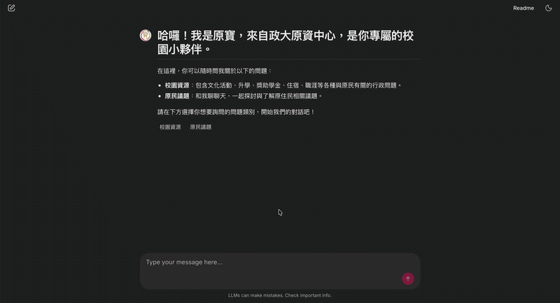

# 原寶 (isrc-rag-bot) - 政大原資中心小幫手

[](https://opensource.org/licenses/MIT)
[](https://www.python.org/downloads/)
[](https://jasonhoooooo-isrc-rag-bot.hf.space)
[](https://snyk.io/worg/jason-hooo/project/288e622b-4878-4657-906e-573a9501eb0d)
[](https://www.repostatus.org/#active)

An AI-powered conversational assistant "原寶" (Yuan Bao) built with Retrieval-Augmented Generation (RAG) technology, specifically designed for the **Indigenous Student Resource Center (ISRC) at National Chengchi University**. The system provides warm and friendly assistance to students and faculty in querying campus indigenous resources, scholarships, tuition waivers, housing rights, and cultural activities.

## Demo



[](https://jasonhoooooo-isrc-rag-bot.hf.space)

## Features

- **Dual-Topic Selection**: Users choose between "Campus Resources" (校園資源) or "Indigenous Issues" (原民議題) for focused retrieval
- **Automatic Category Classification**: AI-powered classification of campus resources into 5 categories:
  - Cultural Activities & Community Connections (文化活動與社群連結)
  - Indigenous Student Academic Pathways (原住民族學生升學管道)
  - Scholarships & Administrative Affairs (獎助學金與行政庶務)
  - Learning & Campus Life Support (學習與校園生活支持)
  - Career & Development (職涯與發展)
- **Multi-Turn Conversations**: Built with LlamaIndex AgentWorkflow for context-aware dialogue
- **Intelligent Tool Calling**: AI Agent determines when to use knowledge base retrieval vs. direct conversation
- **Metadata-Based Filtering**: Precise Qdrant vector database filtering using topic and category metadata
- **Streaming Responses**: Real-time token streaming with loading animations
- **Conversation Logging**: Automatic logging to Google Sheets for analytics and improvement

## Tech Stack

- **RAG Framework**: LlamaIndex (AgentWorkflow for multi-turn conversations and tool calling)
- **Language Model (LLM)**: Google Gemini 2.5 Flash (`gemini-2.5-flash`)
- **Embedding Model**: JinaAI (`jina-embeddings-v3`)
- **Reranker Model**: JinaAI (`jina-reranker-v2-base-multilingual`)
- **Vector Database**: Qdrant Cloud
- **Frontend Interface**: Chainlit
- **Conversation Logging**: Google Sheets API (via Service Account)

## Project Structure

```
isrc-rag-bot/
├── .chainlit/             # Chainlit configuration files
│   ├── translations/
│   └── config.toml
├── data/                  # Knowledge base source documents (.txt, .pdf, .docx) (create manually)
│   ├── 校園資源/
│   │   ├── 文化活動與社群連結/
│   │   ├── 原住民族學生升學管道/
│   │   ├── 獎助學金與行政庶務/
│   │   ├── 學習與校園生活支持/
│   │   └── 職涯與發展/
│   └── 原民議題/
├── images/                # Demo GIFs
│   └── isrc-rag-bot-demo.gif
├── keys/                  # Google Cloud Service Account JSON key (create manually)
│   └── google-credentials.json
├── public/                # Static resources
│   └── avatars/
│       └── assistant.png
├── src/
│   ├── evaluate_rag.py
│   ├── rag.py             # RAG core engine (indexing, retrieval, agent workflow)
│   └── sheets_logger.py   # Google Sheets logging module
├── .env                   # Environment variables (create manually)
├── .env.example           # Environment variables template
├── .gitignore
├── app.py                 # Chainlit application frontend
├── chainlit.md            # Chainlit welcome page settings
├── LICENSE                # MIT License
├── README.md              # This file
└── requirements.txt       # Python dependencies
```

## Configuration

Create a `.env` file in the project root directory with the following environment variables:

```env
# Google Cloud Service Account JSON key file path
# Download the JSON key file from Google Cloud Console and place it in keys/
GOOGLE_APPLICATION_CREDENTIALS=./keys/google-credentials.json

# GCP Project ID
GOOGLE_CLOUD_PROJECT=your-project-id

# Google Cloud region for running Gemini models
GOOGLE_CLOUD_LOCATION=us-central1

# Google Sheet name for conversation logging
GOOGLE_SHEET_NAME=原資智慧服務 AI 機器人回覆蒐集表

# JinaAI API Key (for Embedding and Reranker)
JINAAI_API_KEY=your-jinaai-api-key

# Qdrant Cloud connection settings
QDRANT_URL=https://your-cluster.qdrant.io
QDRANT_API_KEY=your-qdrant-api-key
```

**Important**: Create a `keys/` directory in the project root and place your Google Cloud Service Account JSON key file there as `google-credentials.json`.

## Data Setup

Place any ISRC-related documents in the `data/` directory. Supported formats: `.pdf`, `.docx`, `.txt`.

**Important**: All `.txt` files must be saved in **UTF-8** encoding to avoid character encoding issues with LlamaIndex during embedding generation.

The system automatically generates metadata based on file structure:
- First-level directory determines `topic` metadata (Campus Resources (校園資源) or Indigenous Issues (原民議題))
- Second-level directory (for Campus Resources (校園資源) only) determines `category` metadata (one of 5 categories)

## Installation

1. Clone the repository:
```bash
git clone https://github.com/yourusername/isrc-rag-bot.git
cd isrc-rag-bot
```

2. Create a virtual environment (recommended):
```bash
python -m venv .venv
source .venv/bin/activate  # On Windows: .venv\Scripts\activate
```

3. Install dependencies:
```bash
pip install -r requirements.txt
```

## Usage

Start the Chainlit server:

```bash
chainlit run app.py -w
```

The web interface will be available at `http://localhost:8000`.

## Docker Deployment

### Build the Docker image:

```bash
docker build -t isrc-rag-bot:v1 .
```

### Run the Docker container:

```bash
docker run -d -p 8000:8000 \
  --env-file .env \
  -v "$(pwd)/keys/google-credentials.json:/app/keys/google-credentials.json" \
  --name yuan-bao isrc-rag-bot:v1
```

The web interface will be available at `http://localhost:8000`.

On first launch, the system will automatically read all documents under `data/` and build the Qdrant Cloud vector index (this may take some time).

## How It Works

### 1. Topic Selection

Users select one of two topics at the start:
- **Campus Resources 校園資源 (resources)**: Query ISRC practical information including cultural activities, academic pathways, scholarships, housing, career, etc.
- **Indigenous Issues 原民議題 (issues)**: Explore indigenous social issues and stories

### 2. Automatic Category Classification

When "Campus Resources" is selected, the AI automatically classifies questions into one or more of 5 categories and uses Qdrant metadata filters for precise retrieval:
- **Cultural Activities & Community Connections (文化活動與社群連結)**: Cultural activities, clubs, communities
- **Indigenous Student Academic Pathways (原住民族學生升學管道)**: Academic advancement guarantees, government-funded study abroad programs
- **Scholarships & Administrative Affairs (獎助學金與行政庶務)**: Scholarships, tuition waivers, housing rights, ISRC basic information
- **Learning & Campus Life Support (學習與校園生活支持)**: Psychological support, identity changes, Hope Seed Cultivation Program, emergency assistance, academic tutoring
- **Career & Development (職涯與發展)**: Civil service exam information, NCCU civil service lectures, summer work-study

### 3. Metadata-Based Filtering

The system uses Qdrant's Metadata Filters for precise retrieval:
- **Campus Resources (校園資源)**: Filter includes both `topic=resources` and `category` (based on AI-determined classification)
- **Indigenous Issues (原民議題)**: Filter includes only `topic=issues`, no category filtering applied

### 4. Intelligent Tool Calling

The AI Agent determines the nature of questions:
- **Casual greetings**: Direct warm responses without knowledge base retrieval
- **Substantive questions**: Prioritizes `isrc_knowledge_base` tool for retrieval
- **No answer handling**: Gracefully informs when information is unavailable, never hallucinates

### 5. Fallback Mechanism

If insufficient results are found in the specified category, the system automatically falls back to global "Campus Resources" search (removes category filter, keeps topic filter).

## License

This project is licensed under the MIT License - see the [LICENSE](LICENSE) file for details.

